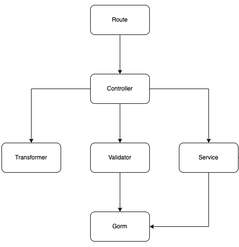
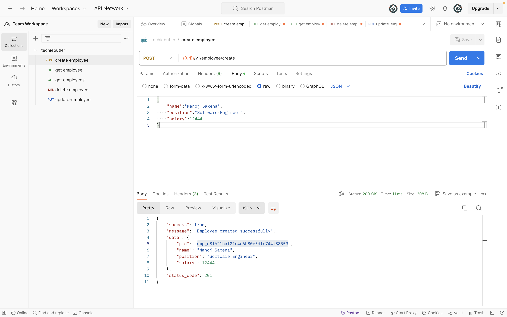

# techie butler

This project implements the core banking layer backend for mool.

<br />

## List of contents:

1. [Pre-requisites](#pre-requisites)
1. [Application DB](#application-db)
1. [Test cases](#test-cases)
5. [Flow hierarchy](#flow-hierarchy)


<br />

### Pre-requisites:  <span id="pre-requisites"></span>

1. GoLang *(ver: 1.19.6)* 
    - Download from [here](https://go.dev/dl/)

2. PostgreSQL *(ver: 14)* 
    - PostgreSQL server [for Linux](https://www.postgresql.org/download/linux/) 
    - PostgreSQL server [for MacOS](https://www.postgresql.org/download/macosx/) 
    - PostgreSQL app [for MacOS](https://postgresapp.com/downloads.html) 
        - Run the below script post installation:
            ```bash
            sudo mkdir -p /etc/paths.d && \
            echo /Applications/Postgres.app/Contents/Versions/latest/bin | \
            sudo tee /etc/paths.d/postgresapp
            ```

<br />


### Application DB:  <span id="application-db"></span>

1. Move to the [dbapp](./dbapp) directory
    ```bash
    $ cd dbapp
    ```
2. Execute the [makefile](./dbapp/Makefile) to migrate and seed
    ```bash
    $ make run
    ```

<br />

### Test cases:  <span id="test-cases"></span>

1. Test cases are a must for all functions.
2. Run the following command
    ```bash
    $ ./run.sh
    ```

<br />

### Flow hierarchy:  <span id="flow-hierarchy"></span>

1. `Routes` can only call `controllers`.
2. `Controllers` can only call `validators`, `transformers` and `services`.
3. `Validators` can only call `gorm`.
4. `Services` can only call `gorm`



### Demo Video:  <span id="flow-hierarchy"></span>
[](https://drive.google.com/file/d/1LvgWOO2l-T04mLr5NVmgEmolUmkwhOFb/view?usp=sharing)

<br />